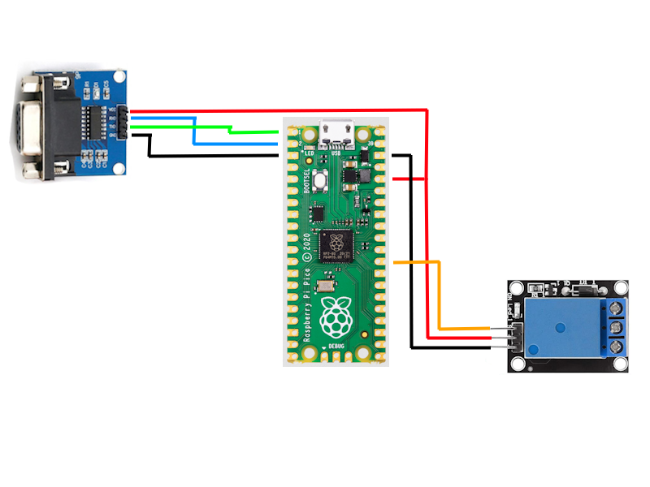

### pico-uart
Simple python program to toggle a relay via com port from another pc

### Idea behind this
Send a command from another pc through one of its com port to the pico and have it turn on or off a relay. My intend was to switch a ATX PSU on or off by having the relay bridge the pson PIN on the 24-PIN cable. 

### UART Config
- 9600 Baud
- 8 Bits
- None Parity
- 1 Stopbit

### Components used
- Pico 2
- RS232 to TTL adapter
- 5v / 3.3v Pico compatible Relay

### Schematic


#### RS232
| Colour    | Pico PIN | Component PIN |
| --------- | -------- |-------------- | 
| Red  | 3.3v OUT    | VCC |
| Blue | RX Pin 2     | RXD |
| Green    | TX Pin 1    | TXD |
| Black | GND | GND |

#### Relay
| Colour    | Pico PIN | Component PIN |
| --------- | -------- |-------------- | 
| Red  | 3.3v OUT    | VCC (+) |
| Black | GND    | GND (-) |
| Orange    | GP22    | S |

### PC Commands
To send data to the pico assuming you use the first com port:

```shell
echo "1" | sudo tee /dev/ttyS0
echo "0" | sudo tee /dev/ttyS0
```

If you use minicom, make sure to change baudrate by pressing CTRL+A followed by O.
